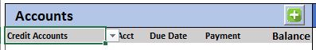

# BillMaster

An advanced Bill organizer with Pay down system. Although this is still a work in progress, almost all features are working. There are a few bugs that I will be working out over time. If you would like to see the current bugs, please look at the issues section and use the bugs filter. What is important to understand, there is noting in this worksheet that sends any data to me, or any server that I can see. I guess Microsoft may have your data if it is on OneDrive.

## How this started

I was a government worker for 22 years, my primary job is a System Administrator and application developer, although I am only a Linux admin. So why did I choose MS Excel? I don't know... More tutorials, more templates, more functions, eh, whatever...

So I got paid twice per month, and I got tired of remembering to pay my bills and it seemed like every weekend I was calculating stamping, and mailing all the bills out. So I made a simple spreadsheet with Libre Office, to put all of my bills in, opened a second checking account, and set up each bill to be auto pay. Getting paid semi-monthly, was pretty easy to know how much to put in the checking out each paycheck to make sure the bills were covered.

Then... I left the government job and started working for a company that pays every other week, this started to get really confusing since twice a year I got paid three times per month, and many checks would have to cover the next month's bills until my first check for the month. It was hard to keep track of. This is where my new version would take the bill date, and assign an amount for each check, no matter where it fell into the month.

## Prerequisites

First and foremost, this script uses VBA and 1 macro, on all versions of Excel, when VBA or Macros are used, a warning will appear at the top of the screen. This template uses VBA for the creation of a new account by copying a template, then changing the Data Index to add the new Bill. The VBA code is:

```vb
Private Sub CommandButton1_Click()
    Dim xName As String
    Dim xSht As Object
    Dim xNWS As Worksheet

    ' On Error Resume Next
        xType = Range("B4").Value ' Get the selection of Credit, Bill, Investment, or Cash
        If xType = "Credit Accounts" Then
            xName = Application.InputBox("Credit Name ", "Credit Account")
            If xName = "" Then
                MsgBox ("User Canceled or Nothing")
                Exit Sub
            End If
        ElseIf xType = "Bill Accounts" Then
            xName = Application.InputBox("Bill Name ", "Bill Account", "")
            If xName = "" Then
                MsgBox ("User Canceled or Nothing")
                Exit Sub
            End If
        ElseIf xType = "Investments" Then
            xName = Application.InputBox("Investment Name ", "Investment Account", "")
            If xName = "" Then
                MsgBox ("User Canceled or Nothing")
                Exit Sub
            End If
        ElseIf xType = "Cash Accounts" Then
            xName = Application.InputBox("Cash Name ", "Cash Account", "")
            If xName = "" Then
                MsgBox ("User Canceled or Nothing")
                Exit Sub
            End If
        End If
        
        ' Depending on the selection, activate the sheet, copy the sheet, make sure it is visable
        ' Give it the name from the message box, change the Data's Index value from 9 to 8 and back
        ' to 9 so it will recalculate the page automatically.
        If xType = "Credit Accounts" Then
            Worksheets("CredTemplate").Activate
            ActiveSheet.Copy after:=Sheets(Sheets.Count)
            Set xNWS = Sheets(Sheets.Count)
            xNWS.Visible = True
            xNWS.Name = xName
            Sheets("Data").Cells(3, 11).Value = 8
            Sheets("Data").Cells(3, 11).Value = 9
            Worksheets(xName).Activate
        ElseIf xType = "Bill Accounts" Then
            Worksheets("BillTemplate").Activate
            ActiveSheet.Copy after:=Sheets(Sheets.Count)
            Set xNWS = Sheets(Sheets.Count)
            xNWS.Visible = True
            xNWS.Name = xName
            Sheets("Data").Cells(3, 11).Value = 8
            Sheets("Data").Cells(3, 11).Value = 9
            Worksheets(xName).Activate
        ElseIf xType = "Investments" Then
            Worksheets("InvestTemplate").Activate
            ActiveSheet.Copy after:=Sheets(Sheets.Count)
            Set xNWS = Sheets(Sheets.Count)
            xNWS.Visible = True
            xNWS.Name = xName
            Sheets("Data").Cells(3, 11).Value = 8
            Sheets("Data").Cells(3, 11).Value = 9
            Worksheets(xName).Activate
        ElseIf xType = "Cash Accounts" Then
            Worksheets("CashTemplate").Activate
            ActiveSheet.Copy after:=Sheets(Sheets.Count)
            Set xNWS = Sheets(Sheets.Count)
            xNWS.Visible = True
            xNWS.Name = xName
            Sheets("Data").Cells(3, 11).Value = 8
            Sheets("Data").Cells(3, 11).Value = 9
            Worksheets(xName).Activate
        End If
End Sub
```

## To start

BillMaster has been designed for people without Excel or computer experience to be able to create, modify, and use almost all features of this system. Open the file with Microsoft Excel Office 365 or newer. 

NOTE: This system uses dynamic tables that was added in Office 365.

Once BillMaster has been opened and you accepted the Warning, you should see a screen like this:


This is the overall Dashboard to give you a quick glance at all bills due, upcoming bills, largest interest, smallest balance, and many other items.

## Entering Income


The first step would be to go to the Income Tab, here you need to enter a minimum of the first payday (I would recommend just starting with this year), for example. Jan 6, 2013 was my first paydate for the year and the pay interator, which I get paid every 14 days. Once that is done, it will populate all of the dates. The next step is to enter your gross pay. If you do not wish to enter all of your tax data, just enter you net pay in the gross pay column. Since I am salary, my checks are 95% the same, so I just copy all of the data down the columns.

## Entering Accounts

Once this has been completed, now head over to the Dashboard Tab and we can start entering accounts.

To add a new account, click on the plus (+) in the account bar. When you click on the (+), it will add a new account depending on which account list you are viewing.



There are 4 types of accounts, Credit Accounts, Bill Accounts, Investment Accounts, and Cash Accounts.

### Credit Accounts

This type of account will have an end date, and may or may not have interest. Some examples of credit accounts are Car Loans, Credit Cards, and other types of loans.

### Bill Accounts

This type of account will not have an end date, and will not have interest. Some examples of bill accounts are Electric, Water, Trash, and Rent

### Investment Accounts

This type of account will have a positive amount, and will does not have an end date. I have not done much on this section, but will be adding other items, such as interest, and returns.

### Cash Accounts

This type of account will be cash on hand. I have a safe with usually a hundred or two in it for emergancys. This account does not have interest, and will be a positive number.

